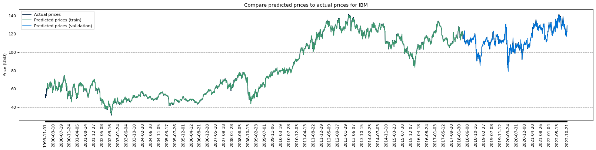

### 🚀 I will be working on this experiment again during summer 2023... stay tuned!

# Stock Data Visualiser

This is a simple stock data visualiser that uses the [Alpha Vantage API](https://www.alphavantage.co/documentation/) to get stock data. I built this to learn more about data crunching and visualisation. The aim of this project is to build a fully functional LSTM model that predicts future stock prices based on historical prices using PyTorch. It is currently in development, and I will be adding more features as I learn more about data visualisation.



## Installation

To install the required packages, run the following command:

```bash
pip install -r requirements.txt
```

## Usage

You can either run the program using the command line, or by using the Jupyter Notebook (locally or on Google Colab - recommended).

### Command Line

To run the program using the command line, run the following command:

```bash
python lstm-model/train.py
```

**Experimental: I am currently developing a web app to pair with this project.** You can run the web app using the following command:

```bash
cd client
yarn install
yarn run dev
```

## Contributing

Pull requests are welcome. For major changes, please open an issue first to discuss what you would like to change. Please make sure to update tests as appropriate. If you have any questions, feel free to open an issue. I will try to respond as soon as possible.
